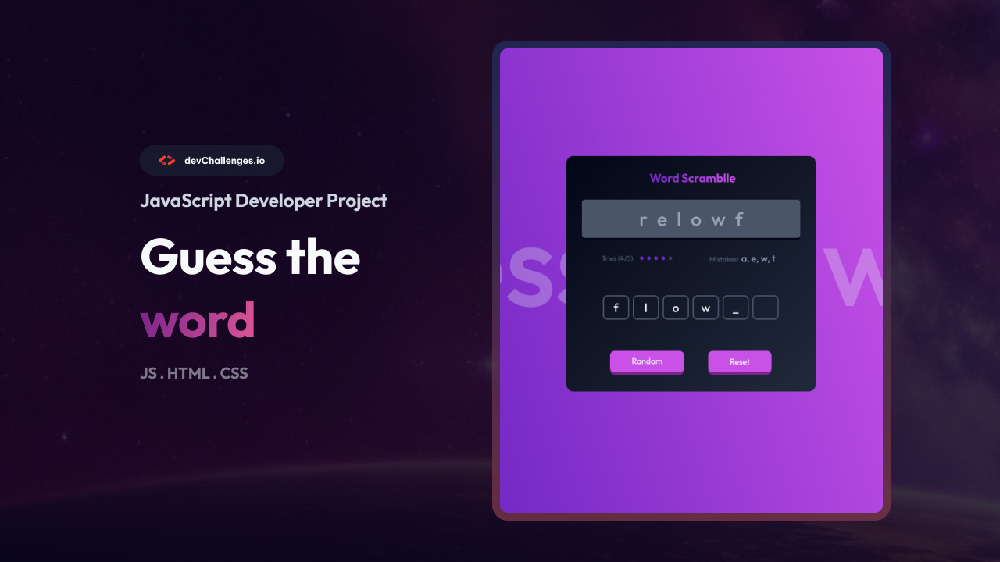

# Guess The Word Game

## Welcome! 👋

Welcome to this responsive web coding challenge.

## The challenge

Create a web page that closely resembles the provided design.

You can use any tools or resources you like to complete this challenge. Each challenge is designed to practice different skills, so be sure to check the challenge description for more information.

If you need help or have any questions, feel free to [join our community](https://github.com/orgs/devchallenges-io/discussions) and ask for support.

## Steps to Complete the Challenge

- [ ] Start by visiting [devChallenges.io](https://devchallenges.io/), navigate to the challenge page, and begin the challenge.
- [ ] Once you have started the challenge, you will have access to the editor where you can download the necessary resources, check colors, fonts, and more.
- [ ] Download the starter/resources, and if you are a Pro user, you can also download the Figma file.
- [ ] Initialize the project as a Git repository.
- [ ] Review the design and analyze the different versions for desktop, tablet, and mobile.
- [ ] Plan your approach to the project by identifying reusable CSS classes and structuring your HTML content.
- [ ] Define the base styles for your project, including font-family, font-size, and other general content styles.
- [ ] Begin adding styles from the top of the page and work your way down, ensuring that each section is visually appealing and matches the provided design.
- [ ] Optimize and resize the required assets from the `/images` folder as necessary.
- [ ] Test your project's responsiveness by previewing it on different devices and screen sizes.
- [ ] Once you are satisfied with your implementation, deploy your project to a hosting platform such as GitHub Pages, Vercel, or Netlify.
- [ ] Submit your solution on devchallenges.io and aim to pass the design comparison and performance tests.
- [ ] Replace the default `README.md` file with a custom one that explains your project and reflects on your learning experience. You can use the provided `README-template.md` as a starting point.

Good luck and enjoy building your project! 🚀

## Deploying your project

- [GitHub Pages](https://pages.github.com/)
- [Vercel](https://vercel.com/)
- [Netlify](https://www.netlify.com/)

## Create your own `README.md`

To use the Readme template, follow these steps:

1. Open the `README-template.md` file in your text editor.
2. Replace the placeholder content with your own project information.
3. Customize the sections and headings to fit your project's needs.
4. Add a detailed description of your project, including its purpose and features.
5. Reflect on your learning experience and any challenges you encountered during development.
6. Delete the original `README.md` file.
7. Rename the `README-template.md` file to `README.md`.
8. Save the changes and commit the updated `README.md` file to your repository.

By following these instructions, you can create a customized `README.md` file that effectively communicates your project to others.
